# deepin 下 QT 应用程序开发


- 事先声明，进行dtk套件的开发有很多种方式，姿势怎么舒服怎么来，不要太教条化，接受指正但不接受无脑批评

  

## 配置

  

### 配置qt开发环境

去往Qt官网的离线安装包地址下载安装相应的qt[离线安装包](https://www.qt.io/offline-installers)

1. 赋予相应启动权限

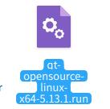

*安装包*

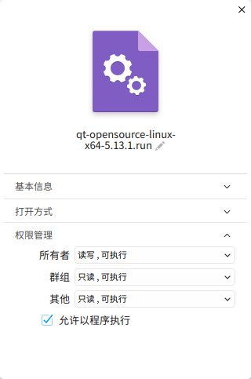

*权限*

2. 运行安装包

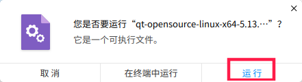

*运行安装包*

3. 一步步向下执行，选择要安装的套件，最后安装

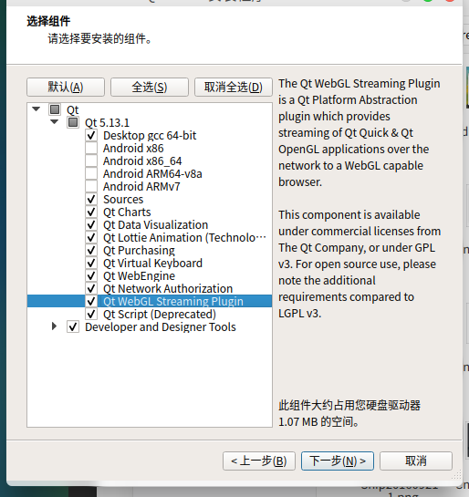

*选择套件*

4. 启动qt creator就可以了

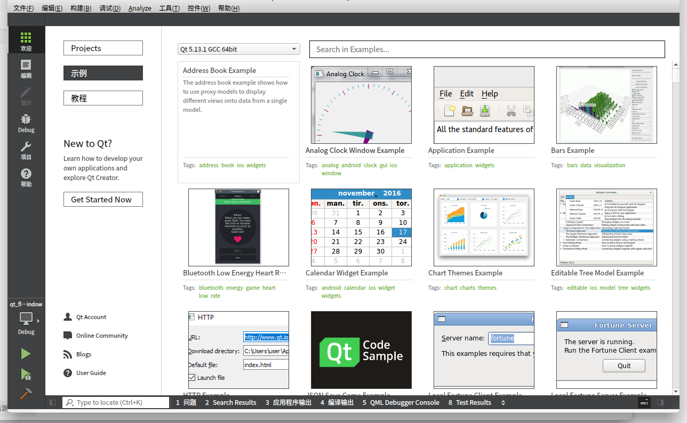

*qtcreator*

### 配置免费好用的vscode开发环境

1. 下载并安装vs code
2. 安装扩展

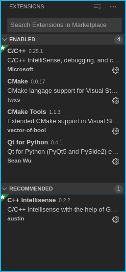

*必要的vscode扩展*

3. 配置ui文件设计者（其他的配置能配置的都配置了）


*配置设计者套件*


### 配置deepin的dtk开发套件

  

#### 编译安装最新dtk套件

- dtk: deepin-tool-kit 项目原本是作为 DTK 项目的代码管理仓库用的，但是后来鉴于对 DTK 分模块管理的期望，将 DTK 分拆成了 dtkwidget、dtkcore 和 dtkwm 三个子项目进行开发。在推进 DTK 文档的过程中，发现刚好可以使用这个项目作为为 DTK 文档生成、管理工具，所以演变成了现在的样子。

##### 编译安装步骤

1. 前往deepin的git中克隆最新的各个dtk套件

- dtkcore: https://github.com/linuxdeepin/dtkcore
- dtkwidget: https://github.com/linuxdeepin/dtkwidget
- dtkwm: https://github.com/linuxdeepin/dtkwm

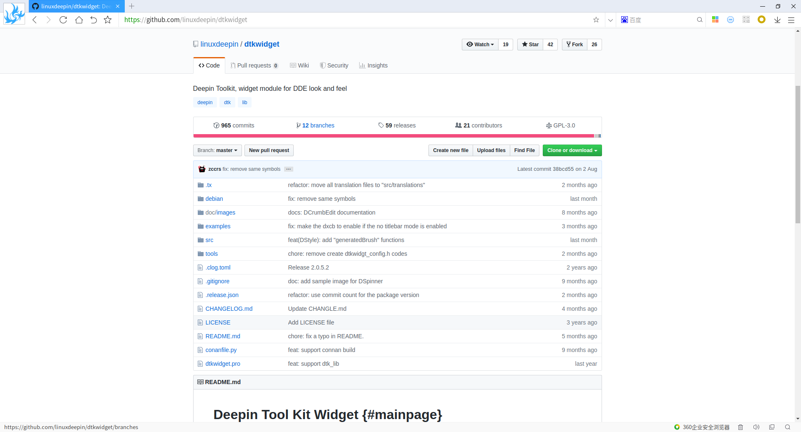

*dtkwidget页面*

2. 安装编译依赖

- 编译的依赖：寻找方式可以通过项目文件夹中debian文件夹里的control文件来找到具体的编译依赖，全部安装依赖即可

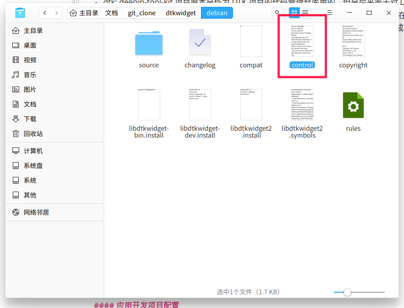

*contrl文件*

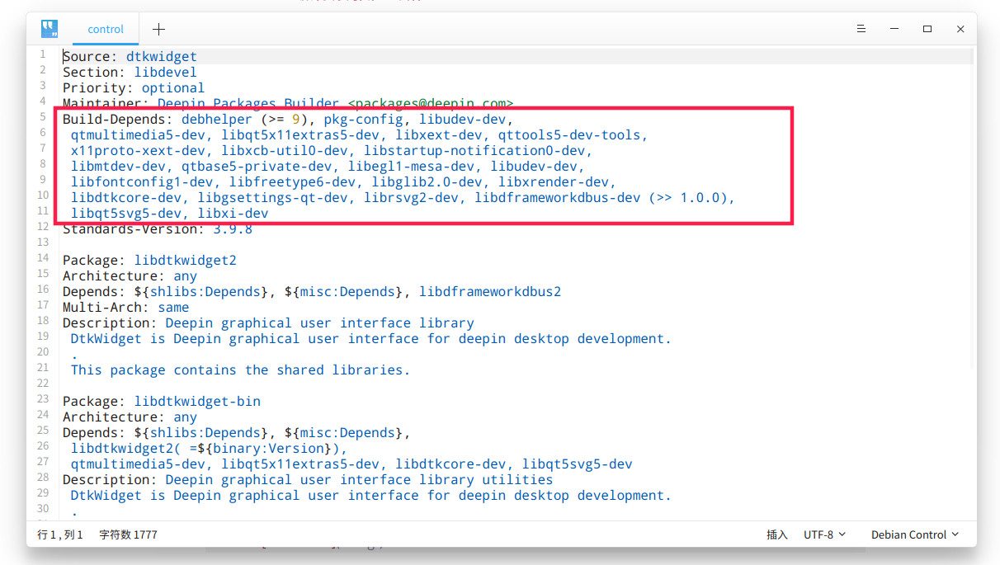

*编译依赖*

- 例如dtkwidget的套件的依赖

```shell ubuntu
sudo apt install debhelper pkg-config libudev-dev qtmultimedia5-dev libqt5x11extras5-dev libxext-dev qttools5-dev-tools x11proto-xext-dev libxcb-util0-dev libstartup-notification0-dev libmtdev-dev qtbase5-private-dev libegl1-mesa-dev libudev-dev libfontconfig1-dev libfreetype6-dev libglib2.0-dev libxrender-dev libdtkcore-dev libgsettings-qt-dev librsvg2-dev libdframeworkdbus-dev libqt5svg5-dev libxi-dev -y
```

3. 根据官方提供的方法编译安装各个dtk套件，三个基本一致

- 通过以下命令编译安装相应套件

```shell
cd project_path
mkdir build
cd build
qmake ..
make
sudo make install
```


#### 应用开发项目配置

##### qtcreator qmake

- 这个是使用qtcreator进行开发（使用qmake的）才需要注意的问题

- 注意在pro文件中添加相应config，否则无法识别出deepin套件

```C++
CONFIG += link_pkgconfig
PKGCONFIG += dtkwidget
```

##### qtcreator cmake

- cmake项目在自己手动建立（下方给出）后导入qtcreator，需要自己重新手动扫描项目，方式：`构建->rescan projiect`，之后才能正确生成项目目录结构，否则报错`"CMAKE_HOME_DIRECTORY" is set but incompatible with configured source dir`
  

## 编程


### 项目说明

本次使用以下方案开发的步骤如下

1. 建立工程文件夹
2. 按照模板建立工程文件
3. 在vscode/qtcreator中编写代码
4. 通过cmake编译运行


### cmake

####模板

- 本模板采用的是[lolimay大佬](https://github.com/lolimay/deepin-develop-guide)的deepin-develop-guide中的内容

使用 CMake 作为构建工具，使用开发软件创建 Qt 项目一个较好的项目模板如下，建议新手创建 Qt 项目均按此模板创建。

##### 项目目录结构

````bash
ProjectName               #项目目录
├── CMakeLists.txt      #项目根目录CMakeLists.txt配置文件
└── src                 #源码目录
    ├── CMakeLists.txt  #源码目录CMakeLists.txt配置文件
    └── main.cpp        #程序入口
````

##### 模板内容

- ProjectName/CMakeList.txt

````cmake ProjectName/CMakeList.txt
cmake_minimum_required(VERSION 3.7)
project(Demo)
add_subdirectory(src)
````

- ProjectName/src/CMakeLists.txt

````cmake ProjectName/src/CMakeLists.txt
cmake_minimum_required(VERSION 3.7)
set(TARGET_NAME Demo)
set(CMAKE_CXX_STANDARD 17)
set(CMAKE_INCLUDE_CURRENT_DIR ON)
set(CMAKE_AUTOMOC ON)
set(CMAKE_AUTORCC ON)
set(CMAKE_AUTOUIC ON)
file(GLOB_RECURSE SOURCES "*.cpp")
file(GLOB_RECURSE HEADERS "*.h")
file(GLOB_RECURSE FORMS "*.ui")
file(GLOB_RECURSE RESOURCES "*.qrc")
find_package(PkgConfig REQUIRED)
set(QT Core Gui Widgets Network DBus Sql)
find_package(Qt5 REQUIRED ${QT})
pkg_check_modules(3rd_lib REQUIRED
        dtkwidget dframeworkdbus
        )
add_executable(${TARGET_NAME} ${SOURCES} ${HEADERS} ${FORMS} ${RESOURCES})
target_include_directories(${TARGET_NAME} PUBLIC ${3rd_lib_INCLUDE_DIRS} )
target_link_libraries(${TARGET_NAME} ${3rd_lib_LIBRARIES} )
qt5_use_modules(${TARGET_NAME} ${QT})
set(CMAKE_INSTALL_PREFIX /usr)
install(TARGETS ${TARGET_NAME} DESTINATION bin)
````

- ProjectName/src/main.cpp

````cpp ProjectName/src/main.cpp
/**
 * Deepin Tool Kit 模板代码
 */
#include <DApplication>
#include <DUtil>
#include <DMainWindow>
#include <DWidgetUtil>
#include <DLog>
#include <zconf.h>

DWIDGET_USE_NAMESPACE
        DCORE_USE_NAMESPACE
int main(int argc, char *argv[]) {
    DLogManager::registerConsoleAppender();
    DLogManager::registerFileAppender();
    DApplication::loadDXcbPlugin();
    DApplication app(argc, argv);
    app.setAttribute(Qt::AA_UseHighDpiPixmaps);
    const QString socket_path(QString("Demo_%1").arg(getuid()));
    if (app.setSingleInstance(socket_path)) {
        app.setTheme("light");
        app.loadTranslator();
        const QString descriptionText = QApplication::tr("A simple Qt Demo by CLion 2018.2 and CMake");
        const QString acknowledgementLink = "https://deepin.lolimay.cn";
        app.setOrganizationName("lolimay");
        app.setApplicationName("Demo");
        app.setApplicationDisplayName(QObject::tr("Demo"));
        app.setApplicationVersion("1.0.0");
        app.setProductName(QApplication::tr("Demo"));
        app.setApplicationDescription(descriptionText);
        app.setApplicationAcknowledgementPage(acknowledgementLink);

        DMainWindow window;
        window.setFixedWidth(600);
        Dtk::Widget::moveToCenter(&window);
        window.show();
        return app.exec();
    }
    qDebug() << "app has started";
    return 0;
}
````

####编译运行程序

##### VsCode

- 使用顺序如下

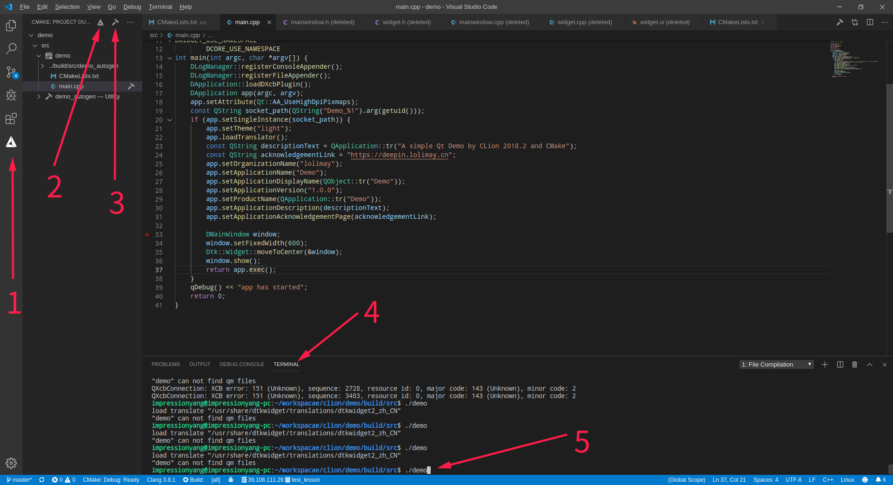


1. 进入cmake
2. 编译
3. 构建
4. 进入控制台页面
5. 运行程序  `./demo`，因为项目的目标文件是demo


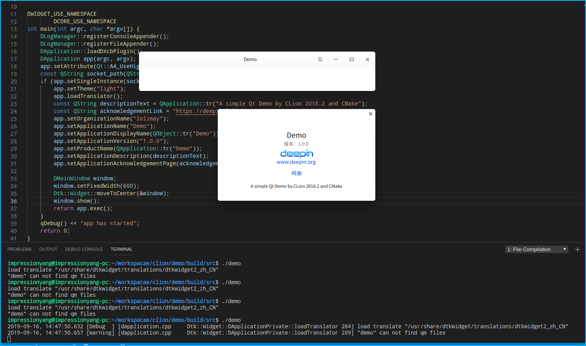

*运行程序*

##### Qtcreator

- 直接点击左下角运行图标即可

  

### 基本语法

  

### 高级

  

#### QRC文件

qrc文件是qt定制的一种管理项目资源文件的标准，其显示在qtcreator中的效果如下：

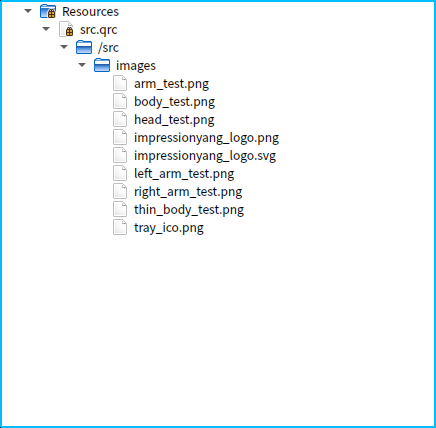

**sample**

- filename: src.qrc

```xml
<RCC>
    <qresource prefix="/src">
        <file>images/impressionyang_logo.png</file>
        <file>images/impressionyang_logo.svg</file>
        <file>images/tray_ico.png</file>
        <file>images/head_test.png</file>
        <file>images/arm_test.png</file>
        <file>images/body_test.png</file>
        <file>images/left_arm_test.png</file>
        <file>images/right_arm_test.png</file>
        <file>images/thin_body_test.png</file>
    </qresource>
</RCC>

```

**using**

- 使用qrc资源的路径

```C++
:/src/images/left_arm_test.png
```

#### MainWindow

很多应用程序都是从一个mainwindow开始的，mainwindow是一个带有菜单的窗口，其中包含了一个默认的布局

- 其实现代码如下

```h mainwindwo.h
#include <DMainWindow>

DWIDGET_USE_NAMESPACE

class MainWindow : public DMainWindow {
    Q_OBJECT

public:
    MainWindow(QWidget *parent = nullptr);
    
};
```

*mainwindwo.h*

```cpp mainwindow.cpp
#include "mainwindow.h"

MainWindow::MainWindow(QWidget *parent) : DMainWindow(parent){
    
}
```

*mainwindwo.cpp*

- 需要注意的一点是mainwindow的自带布局会导致直接添加组件或布局会无法显示的情况，解决方法是利用`setCentralWidget()`方法设置一个`QWidget`使其能够通过Qwidget添加布局

####Widget

- Widget是类似类似于mainwindow的窗口组件，但是它是一个空白的窗体组件，可以自由添加布局和其他组件

- 实现代码

```h mywidget.h
#ifndef WIDGET_H
#define WIDGET_H

#include <QWidget>

class MyWidget : public QWidget
{
    Q_OBJECT
private:
    /* data */
public:
    MyWidget(QWidget *parent=nullptr);
    ~MyWidget();
};

#endif  //WIDGET_H
```

*mywidget.h*

```cpp mywidget.cpp
#include "mywidget.h"

MyWidget::MyWidget(QWidget *parent):QWidget(parent)
{
    
}

MyWidget::~MyWidget()
{
}
```

*mywidget.cpp*

####布局

- 布局是指专门用来规定布局的组件产生的效果，使用不同的布局组件会使得添加到布局组件的其他组件在屏幕上呈现出不同的排列效果
- 在qt中经典的布局组件有QHBoxlayout、QVBoxlayout、QGridLayout、QFormLayout四大布局

|   布局   |  作用    |
| ---- | :--: |
|   QHBoxlayout   |  水平布局，使其中的组件呈水平方向按顺序排列    |
|   QVBoxlayout   | 垂直布局，使其中的组件呈垂直方向按顺序排列 |
|	QGridLayout  |      |
|	QFormLayout||


- 示例如下


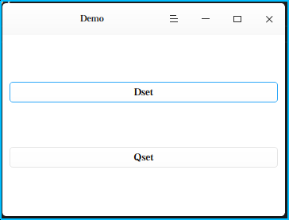

*垂直布局*

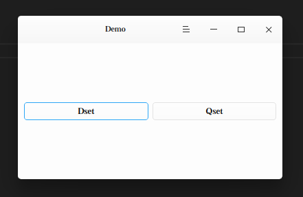

*水平布局*


#### 使用空间

- 空间是指能够给个组件之间插入间隙的操作

可以使用的空间操作有

- 各个布局含有的`addStretch()`方法、

#### Label

- Label是可以显示简单文本和填充图片的标签组件，使用label组件可以在布局中显示一些提示信息

- 代码实现

- main.cpp文件内容不变

- mainwindow

```h mainwindow.h
#include <DMainWindow>
#include "labeltest.h"

DWIDGET_USE_NAMESPACE

class MainWindow : public DMainWindow {
    Q_OBJECT

public:
    MainWindow(QWidget *parent = nullptr);

private:
    QWidget *widget;
};
```

- mianwindow.cpp

```cpp mainwindow.cpp
#include "mainwindow.h"

MainWindow::MainWindow(QWidget *parent) : DMainWindow(parent){

    widget=new LabelTest();
    this->setCentralWidget(widget);
    setWindowTitle("demo test");
    setWindowIcon(QIcon(":/src/images/tray_ico.png"));
}
```

- labeltest.h

```h labeltest.h
#ifndef LABELTEST_H
#define LABELTEST_H

#include <dlabel.h>
#include <QLabel>
#include <QVBoxLayout>
#include <QWidget>

class LabelTest : public QWidget
{
    Q_OBJECT
private:
    /* data */
public:
    LabelTest(QWidget *parent=nullptr);
    ~LabelTest();
};

#endif  //LABELTEST_H
```

- labeltest.cpp

```cpp labeltest.cpp
#include "labeltest.h"


LabelTest::LabelTest(QWidget *parent):QWidget(parent)
{
    setWindowTitle("demo test label");

    QLabel *la=new QLabel("1222");
    QLabel *la2=new QLabel("this is qlabel");
    Dtk::Widget::DLabel *label=new Dtk::Widget::DLabel("this is dlabel");
  

    la->setMaximumSize(2000,2000);
    la->setPixmap(QPixmap::fromImage(QImage(":/src/images/tray_ico.png")));

    QVBoxLayout *layout=new QVBoxLayout();
    
    layout->addWidget(la);
    layout->addStretch();
    layout->addWidget(la2);
    layout->addStretch();
    layout->addWidget(label);
    
    

    setLayout(layout);
}

LabelTest::~LabelTest()
{
}

```

- 效果

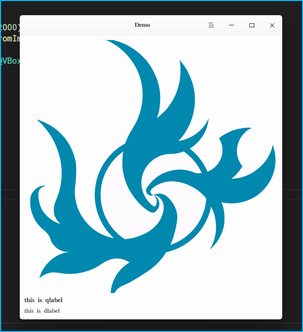

  

#### LineEdit

- LineEdit是一个可以单行输入的文本框组件，可以在单行中输入文本

- 代码实现

- main.cpp文件内容不变

- mainwindow

```h mainwindow.h
#include <DMainWindow>
#include "labeltest.h"

DWIDGET_USE_NAMESPACE

class MainWindow : public DMainWindow {
    Q_OBJECT

public:
    MainWindow(QWidget *parent = nullptr);

private:
    QWidget *widget;
};
```

- mianwindow.cpp

```cpp mainwindow.cpp
#include "mainwindow.h"

MainWindow::MainWindow(QWidget *parent) : DMainWindow(parent){

    widget=new LabelTest();
    this->setCentralWidget(widget);
    setWindowTitle("demo test");
    setWindowIcon(QIcon(":/src/images/tray_ico.png"));
}
```

- lineedittest.h

```h lineedittest.h
#ifndef LINEEDITTEST_H
#define LINEEDITTEST_H


#include <QWidget>
#include <QLineEdit>
#include <dlineedit.h>
#include <QVBoxLayout>
#include <QLabel>

class LineEditTest : public QWidget{
    Q_OBJECT
public:
    LineEditTest(QWidget *parent=nullptr);
    ~LineEditTest();

};

#endif /* LINEEDITTEST_H */
```

- lineedittest.cpp

```cpp lineedittest.cpp
#include "lineedittest.h"

LineEditTest::LineEditTest(QWidget *parent): QWidget(parent){
    QLineEdit *lineEdit=new QLineEdit();
    QLineEdit *lineEdit2=new QLineEdit("这是带提示的输入框");
    Dtk::Widget::DLineEdit *dLineEdit1=new Dtk::Widget::DLineEdit();
    QLabel *label=new QLabel("下面是Dlabel");
    QVBoxLayout *layout=new QVBoxLayout();
    layout->addWidget(lineEdit);
    layout->addStretch();
    layout->addWidget(lineEdit2);
    layout->addStretch();
    layout->addWidget(label);
    layout->addWidget(dLineEdit1);
    layout->addStretch();
    this->setLayout(layout);

}

LineEditTest::~LineEditTest(){

}
```

- 效果
- 以后的代码基本上都是只写出改动的部分，未改动的就不列出来了，有点浪费篇幅

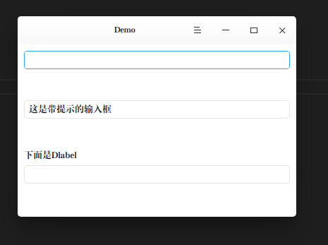

#### TextEdit

- TextEdit提供了一个可以编辑多行文本的控件，使用它可以进行多行文本编辑操作

- 实现

- textedittest.h

```h textedittest.h
#ifndef TEXTEDITTEST_H
#define TEXTEDITTEST_H

#include <QWidget>
#include <QTextEdit>
#include <QVBoxLayout>
#include <dtextedit.h>
#include <QLabel>

class TextEditTest : public QWidget
{
    Q_OBJECT

public:
    TextEditTest(QWidget *parent = nullptr);
    ~TextEditTest();
};

#endif /* TEXTEDITTEST_H */
```

- textedittest.cpp

```cpp textedittest.cpp
#include "textedittest.h"

TextEditTest::TextEditTest(QWidget *parent) : QWidget(parent)
{
    QLabel *l1=new QLabel("这是qtextedit");
    QLabel *l2=new QLabel("这是dtextedit");

    QTextEdit *textEdit1 = new QTextEdit();
    Dtk::Widget::DTextEdit *textEdit2 = new Dtk::Widget::DTextEdit(this);

    QVBoxLayout *layout = new QVBoxLayout();

    layout->addWidget(l1);
    layout->addWidget(textEdit1);
    layout->addStretch();
    layout->addWidget(l2);
    layout->addWidget(textEdit2);
    layout->addStretch();


    this->setLayout(layout);
}

TextEditTest::~TextEditTest()
{
}
```

- 效果

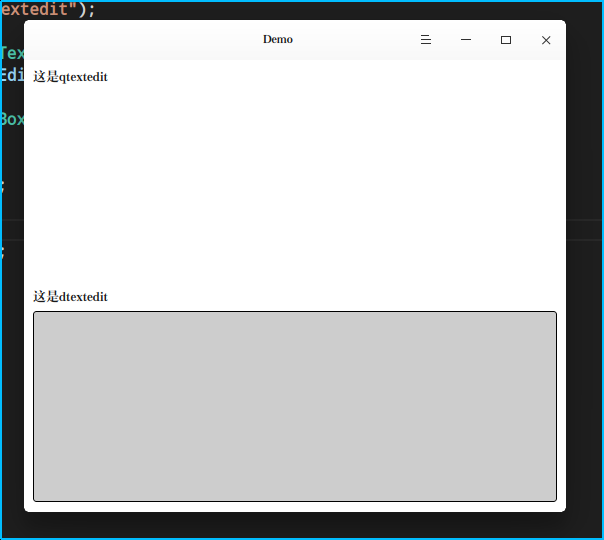

#### PushButton

- PushButton提供了一个可以按下的按钮操作，使用按钮可以发出一些信号来链接槽，下一章节再讲
- 实现

- pushbuttontest.h

```h pushbuttontest.h
#ifndef PUSHBUTTONTEST_H
#define PUSHBUTTONTEST_H

#include <QWidget>
#include <QPushButton>
#include <dpushbutton.h>
#include <QVBoxLayout>
#include <QLabel>

class PushButtonTest : public QWidget{
    Q_OBJECT
public:
    PushButtonTest(QWidget *parent = nullptr);
    ~PushButtonTest();
};

#endif /* PUSHBUTTONTEST_H */
```

- pushbuttontest.cpp

```cpp pushbuttontest.cpp
#include "pushbuttontest.h"

PushButtonTest::PushButtonTest(QWidget *parent) : QWidget(parent){
    QPushButton *pushbutton=new QPushButton("qpushbutton");
    Dtk::Widget::DPushButton *dpushbutton=new Dtk::Widget::DPushButton();
    dpushbutton->setText("dpushbutton");
    QLabel *label=new QLabel("下面是DPushButton");
    QVBoxLayout *layout=new QVBoxLayout();
    layout->addWidget(pushbutton);
    layout->addStretch();
    layout->addWidget(label);
    layout->addWidget(dpushbutton);
    layout->addStretch();
    this->setLayout(layout);
}

PushButtonTest::~PushButtonTest(){

}
```


- 效果

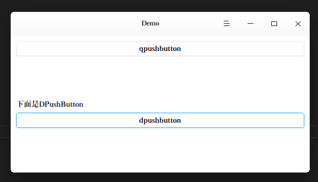

#### 信号和槽

- 信号和槽是Qt的经典之处，很多组件通过信号和槽之间的配合就能实现出其他语言的多线程效果，可谓是Qt的一大利器
- 信号和槽的关系

顾名思义，信号就是一种消息机制，某个组件可以由用户需求（如按下）自己发出一个信号，而槽就是接受信号的机制，槽本质上其实就是一个实现了的方法（函数），当信号连接到槽并且信号被提交之后，相应的槽函数就会被激活，并且根据信号上的内容执行不同的操作

- 信号和槽在某些组件上是已经写好默认的了，当然如果你想给自定义组件上或者重写的组件上添加自定义的信号和槽也是可以的

- 下面就用信号和槽来做一个演示，点击（PushButton）按钮（Label上）显示点击次数

- 实现

- 信号和槽的常用连接有几种方法

```C++
QObject::connect(&m_signal,SIGNAL(signals()),&m_slot,SLOT(slot()));

QObject::connect(&m_signal,&QCSignal::signals,&m_slot,&QCSignal::slot)

QObject::connect(&m_signal,&QCSignal::signals,&m_slot,[](){//lamda函数})
```

- 讲解：3种方法，第1和第2种方法都是使用已经定义的槽和函数进行链连接，第1种是可以进行参数传递的，第二种方法不能出现槽或者信号参数的重载，而我本人比较喜欢的是第3种，槽使用lamda表达式进行自定义槽函数，使得槽函数更灵活。
- 使用信号和槽的示例代码
- signalslottest.cpp中

```c++
	count=0;

    QVBoxLayout *layout=new QVBoxLayout();
    QLabel *label=new QLabel("0");
    QPushButton *btn=new QPushButton("add");
    QSlider *slider=new QSlider(Qt::Horizontal);

    layout->addStretch();
    layout->addWidget(label);
    layout->addStretch();
    layout->addWidget(btn);
    layout->addStretch();
    layout->addWidget(slider);
    layout->addStretch();

    this->setLayout(layout);

    connect(btn,&QPushButton::clicked,label,[=](bool a){
        count++;
        label->setText(QString::number(count));
    });


    connect(slider,SIGNAL(valueChanged(int)),label,SLOT(setNum(int)));

    // 相同效果
    // connect(slider,&QSlider::valueChanged,label,[=](int value){
    //     label->setNum(value);
    // });
```

- 效果如下

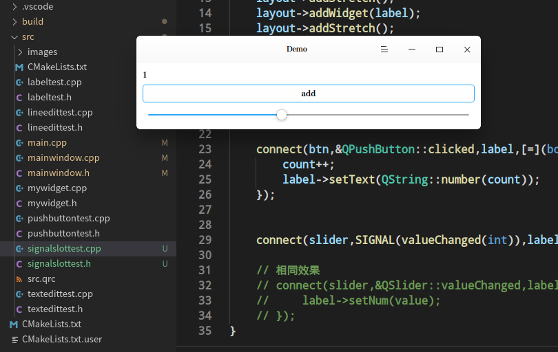

- 自定义信号和槽

**信号**  

信号只需要定义即可，无需写实现代码，并且定义信号之后需要对信号的相应进行类似注册的操作（即emit），需要在某个方法emit该信号，方可使得信号可以在这个方法调用的时候激活信号并且确定信号传输的消息，否则信号就无用武之地了。  

**槽**  

槽函数的话就是写出其自身的功能就好，等待与信号链接之后信号激活是相应  

- 所以一整套/自定义的信号和槽总结如下
- 定义阶段：定义信号和槽，信号需要emit
- 连接：使用connect函数连接，但此时并未响应任何界面变动
- 使用阶段：当信号被激活，即emit该信号的方法被调用时，连接好的槽函数将会响应并影响界面


- **实现**

- diysignaltest.h

```h diysignaltest.h
#ifndef DIYSIGNALTEST_H
#define DIYSIGNALTEST_H

#include <QWidget>
#include <QLabel>
#include <QHBoxLayout>

class DiySignalTest: public QWidget{
    Q_OBJECT
public:
    DiySignalTest(QWidget *parent=nullptr);

private:
    QLabel *label;

protected:

    void resizeEvent(QResizeEvent *event) override;

signals:
    
    void window_vchange(int);

};

#endif /* DIYSIGNALTEST_H */
```

- diysignaltest.cpp


```cpp diysignaltest.cpp
#include "diysignaltest.h"

DiySignalTest::DiySignalTest(QWidget *parent):QWidget(parent){
    QHBoxLayout *layout=new QHBoxLayout();
    label=new QLabel("default");
    QLabel *l=new QLabel("窗口宽度:");

    layout->addWidget(l);
    layout->addWidget(label);

    this->setLayout(layout);

    connect(this,&DiySignalTest::window_vchange,label,[=](int v_width){
        label->setNum(v_width);
    });

}

void DiySignalTest::resizeEvent(QResizeEvent *event){
    int value=this->width();
    emit window_vchange(value);
}
```


- **效果**

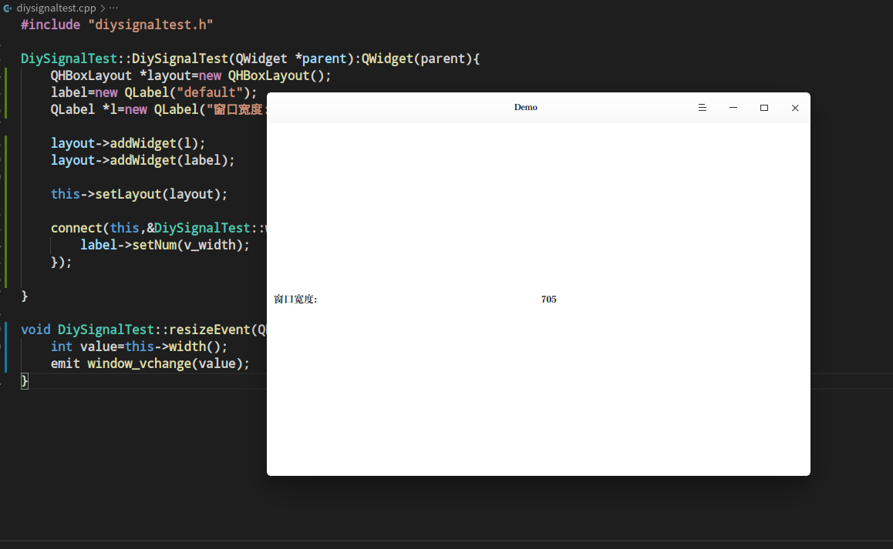


#### ListView

- Listview是一个能够存放一列数据的列表组件，一般是存放item数据或者variant数据，将数据存放进去之后可以通过响应点击之类的信号后返回被点击item的index，可以与list相互配合存放自定义类。
- 使用listview不能直接通过listview来添加或者操作列表组件的元素，而是通过一个model来设置、操作listview中的元素。简单来说，用房子当做例子，listview就是销售的，他只是给你卖了一个房子而已，他不管你要怎么装修这个房子，但是如果你要改变房子的装修或者布局就得请工人，也就是model来进行了。
- 所以，使用listview，就要配合model来进行操作与初始化。

**实现方式**  

listviewtest.h

```h listviewtest.h
#ifndef LISTVIEWTEST_H
#define LISTVIEWTEST_H

#include <QWidget>
#include <QHBoxLayout>
#include <QVBoxLayout>
#include <QListView>
#include <QLabel>
#include <QStandardItem>
#include <QStandardItemModel>
#include <QList>
#include <dlistview.h>
#include <QDebug>

class ListViewTest : public QWidget{
    Q_OBJECT
public:
    ListViewTest(QWidget *parent=nullptr);

private:


};

#endif /* LISTVIEWTEST_H */
```

**listviewtest.cpp**

```cpp listviewtest.cpp
#include "listviewtest.h"

ListViewTest::ListViewTest(QWidget *parent):QWidget(parent){

    QHBoxLayout *layout=new QHBoxLayout();
    QVBoxLayout *l_layout=new QVBoxLayout();
    QVBoxLayout *r_layout=new QVBoxLayout();

    QListView *listview=new QListView();
    Dtk::Widget::DListView *dlistview=new Dtk::Widget::DListView();
    QStandardItemModel *model=new QStandardItemModel();
    QLabel *l_label=new QLabel("QListview");
    QLabel *r_label=new QLabel("DListview");
    QLabel *l_d_label=new QLabel("default");
    QLabel *r_d_label=new QLabel("default");


    QStandardItem *item1=new QStandardItem(QIcon(":/src/images/tray_ico.png"),"1");
    QStandardItem *item2=new QStandardItem(QIcon(":/src/images/tray_ico.png"),"2");
    QStandardItem *item3=new QStandardItem(QIcon(":/src/images/tray_ico.png"),"3");
    QStandardItem *item4=new QStandardItem(QIcon(":/src/images/tray_ico.png"),"4");
    QStandardItem *item5=new QStandardItem(QIcon(":/src/images/tray_ico.png"),"5");
    QStandardItem *item6=new QStandardItem(QIcon(":/src/images/tray_ico.png"),"6");

    model->appendRow(item1);
    model->appendRow(item2);
    model->appendRow(item3);
    model->appendRow(item4);
    model->appendRow(item5);
    model->appendRow(item6);

    listview->setModel(model);
    dlistview->setModel(model);

    l_layout->addWidget(l_label);
    l_layout->addWidget(listview);
    l_layout->addWidget(l_d_label);

    r_layout->addWidget(r_label);
    r_layout->addWidget(dlistview);
    r_layout->addWidget(r_d_label);

    layout->addLayout(l_layout);
    layout->addLayout(r_layout);

    this->setLayout(layout);
    this->setMinimumWidth(500);

    connect(listview,&QListView::clicked,l_d_label,[=](const QModelIndex & index){
        int row=index.row();
        l_d_label->setNum(row);
    });

    connect(dlistview,&Dtk::Widget::DListView::clicked,r_d_label,[=](const QModelIndex & index){
        int row=index.row();
        r_d_label->setNum(row);
    });
}
```

**实现效果**

- 我用listview把之前的类都存放起来了，具体实现在`widgetlistview`类文件中，请自行查看。

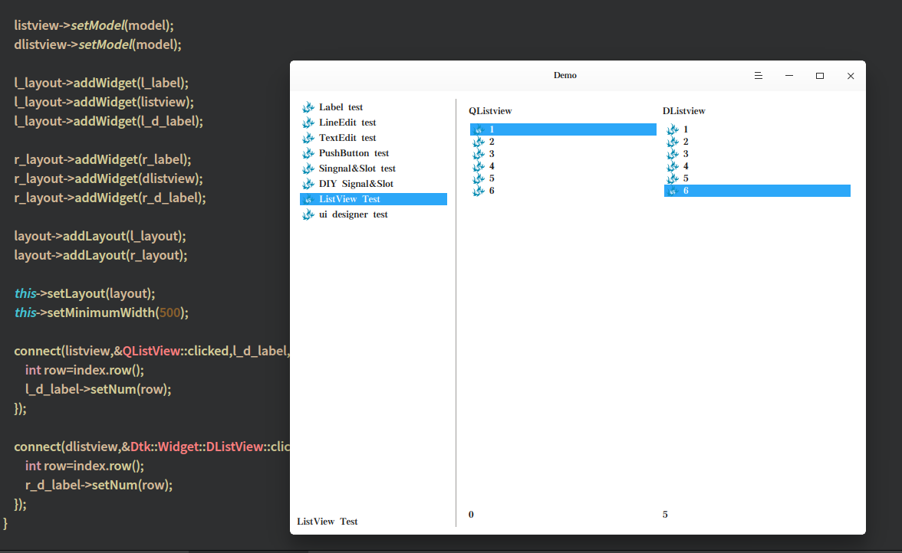

#### CheckBox

#### RadioButton

#### Slider

#### TableView


